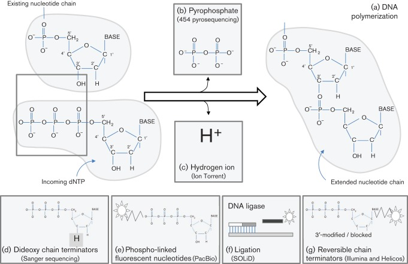
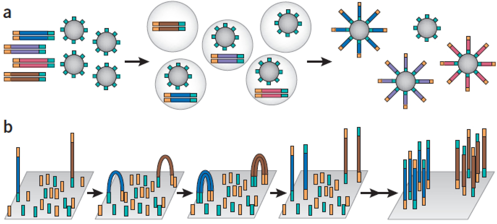
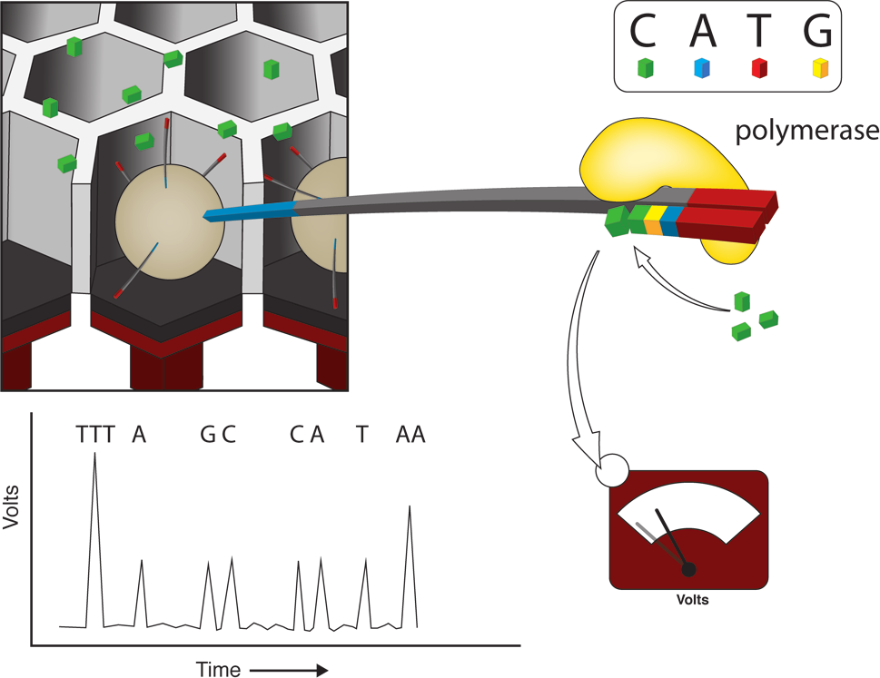
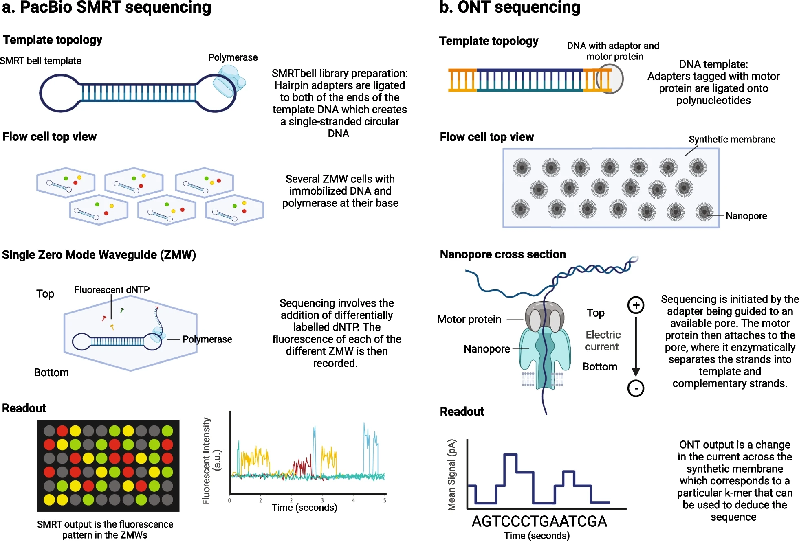
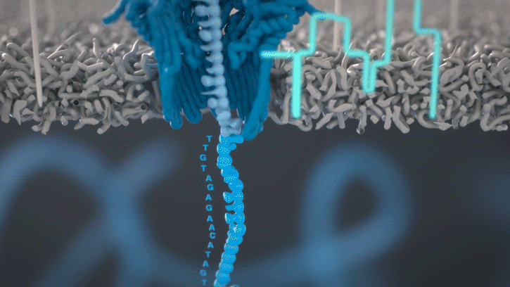
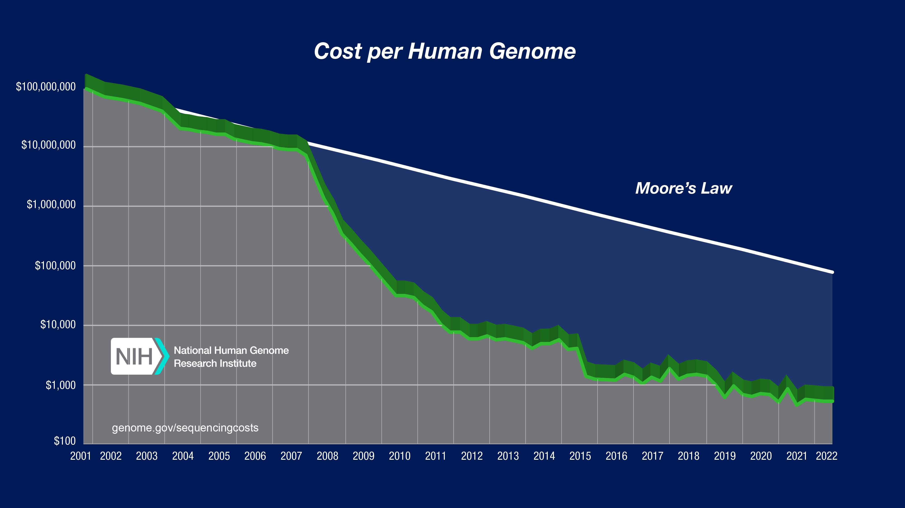
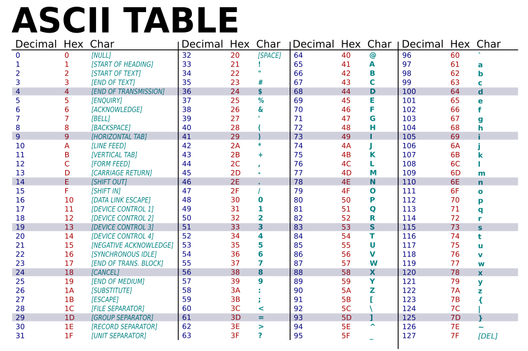
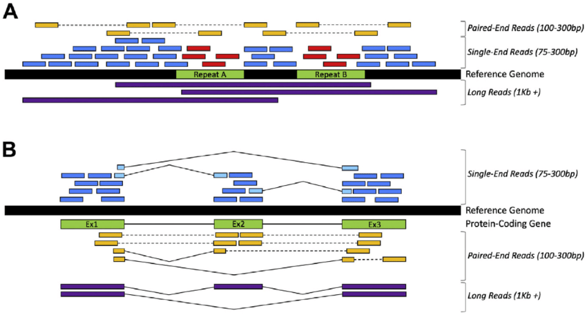
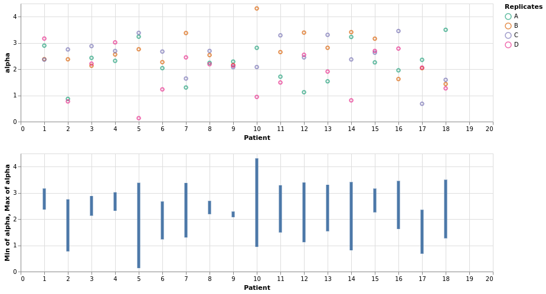
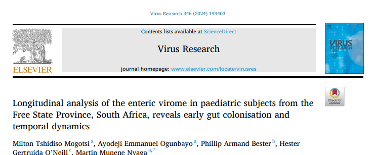

[Introduction]: #####------> Section for brief introduction

## Hacking the chemistry of DNA polymerization

::: {#fig-DNA_chem layout-ncol=1}



Radford AD, et al (2012) DOI: 10.1099/vir.0.043182-0

:::

## Clonal amplification and sequencing by synthesis

::: {#fig-clonal layout-ncol=1}

{width=80%}

Leong IUS, et al (2014) DOI: 10.3390/medsci2020098. **a)** 454/IonTorrent, **b)** Illumina

:::

## Ion Torrent

`One molecule, one bead, one bubble, one well`

* emPCR for clonal amplification
    * DNA fragments or amplicons, adapters are ligated to both ends
        * More beads than DNA molecules
        * Adapters serves as PCR priming sites
        * ... 'primers' are attached to the beads
    * Beads are embedded in oil droplets
        * one bead per droplet
        * Micro PCR vesecle
    * Vesecles are disrupted

---

* Wells fit only one bead
* Amplification with only one of A,C,G,T provided at a time
* Incorporation of a dNTP yields a proton / $H^+$ ion
* pH changes releative to the number of specific dNTP incorporation

::: {#fig-clonal layout-ncol=1}

{width=50%}

Escalante AE, et al (2014) DOI: 10.7550/rmb.43498.

:::


## Ion Torrnet: Pros vs Cons

* Pros: Faster, cheeper, natural chemistry, no ropes and pulleys 
* Cons: Homopolymer issues, `slightly` lower Q-scores compared to Illumina

::: {#fig-homopol layout-ncol=1}

{width=25%}

OpenAI: Depict a skyscraper vs a 3-story building in a cartoon style

:::

## Ion Torrrent: Sales pitch




## Stems from older Roche 454 sequencing

* $PP_i$ + adenosine $5′$ phosphosulfate + **ATP sulfurylase** $->$ ATP + $SO_4^{-2}$
* ATP + luciferin + **luciferase** $->$ AMP + $PP_i$ + oxyluciferin + $CO_2$ ​+ light
* The enzyme apyrase degrades ATP and any unused or unincorporated nucleotides

::: {#fig-roche454 layout-ncol=1}

{width=70%}

Flux AI: Depict fireflies in photorealistic style

:::


## Illumina sequencing

`clonal 'pixels' by bridge amplification`

::: {#fig-roche454 layout-ncol=1}

{width=80%}

Flux AI: Depict a bamboo forest in photo realistic style

:::

## Principle

* Library prep
    * DNA is fragmented, typically transposons/transposases are used, but other fragmentation methods also exist
*   Clonal amplification
    * Bridge amplification is used rather than emulsion PCR (emPCR)
    * This happens on flow cell clusters and not beads

--- 

* In each cycle all four nucleotides are available
    * They are fluorescently labeled AND 3` terminus is blocked
    * The incorporated nucleotide is excited by light
    * The incorporated base is determined by the frequency of the light which was emitted
    * The 3` end is unblocked and a new cycle begins
        * Only one nucleotide can be incorporated in a cycle
        * The read length is determined by the number of cycles
* The DNA fragments are typically sequenced from both ends, resulting in paired reads


## Illumina: Sales pitch

* Pros: Does not suffer from homopolymer issues, higher Q-scores
* Cons: Slower, more expensive (modified dNTPS)




## Single molecule sequencing

::: {#fig-single_mol layout-ncol=1}

{width=75%}

Oehler JB, et al (2023) DOI: 10.1186/s40246-023-00522-3

:::

## Oxford Nanopore Technologies

::: {#fig-ont layout-ncol=1}



https://nanoporetech.com/platform/technology/basecalling

:::


## Cost vs. Moore

::: {#fig-moore layout-ncol=1}



https://www.genome.gov/about-genomics/fact-sheets/DNA-Sequencing-Costs-Data

:::

## Phred / Q-scores

Developed by Phil Green and Brent Ewing, 1990s

$$
Q=−10.log_{10}(p)
$${#eq-Q-score}

or

```
Q10 = 90%         (1/10 chance of an incorrect base call)
Q20 = 99%         (1/100 chance of an incorrect base call)
Q30 = 99.9%       (1/1,000 chance of an incorrect base call)
Q40 = 99.99%      (1/10,000 chance of an incorrect base call)
Q50 = 99.999%     (1/100,000 chance of an incorrect base call)
Q60 = 99.9999%    (1/1,000,000 chance of an incorrect base call)
```
    These have been adopted by NGS technologies and is encoded in the FASTQ files

## Raw data and quality

::: {#fig-fastq layout-ncol=2}




https://www.drive5.com/usearch/manual/fastq_files.html

:::


## The puzzel and the box

::: {#fig-puzzel layout-ncol=2}

{width="100%"}



DallE generated flowers & Read types
:::


## SARS-CoV-2

::: {#fig-alpha layout-ncol=1}
{width="65%"}

Illustration by David S. Goodsell, RCSB Protein Data Bank; doi: 10.2210/rcsb_pdb/goodsell-gallery-026
:::
[Goodsell gallery](https://pdb101.rcsb.org/sci-art/goodsell-gallery/)


## Tiling PCR

::: {#fig-primal_scheme layout-ncol=2}

{width="80%"}

{width="120%"}

Trippy tunes and tiling PCR design software
:::


## Infant microbiome

::: {#fig-alpha layout-ncol=1}
{width="65%"}

Alpha diversities over time
:::

$$
H_s = - \sum_{i=1}^k p_i log_2(p_i)
$${#eq-Shannon}

## ...Example results

::: {#fig-alpha layout-ncol=1}



* Krona reports
    
    [Krona 5b](html/krona/VRM-5B.krona.html)

    [Krona 5d](html/krona/VRM-5D.krona.html)

* [Pavian analysis](html/Uploaded_sample_set-report.html)


:::